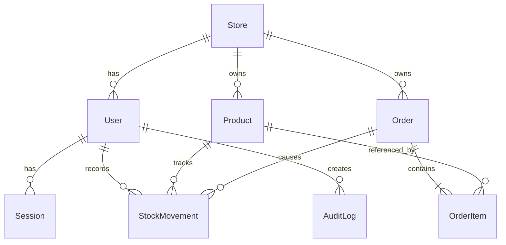

# Stokita

Portofolio full stack untuk inventaris dan pesanan multi-toko. Dibuat dengan React, TypeScript, Tailwind CSS, Express, Prisma, dan PostgreSQL.

## Jalankan lokal

1. Siapkan Node.js 22+ dan PostgreSQL. Buat database `stokita`.
2. Salin `.env.example` ke `.env`, lalu ubah `DATABASE_URL`, `DIRECT_URL`, dan `SEED_DEMO_PASSWORD`. Untuk PostgreSQL lokal, kedua URL boleh sama.
3. Jalankan `npm install`, `npm run db:deploy`, dan `npm run db:seed`.
4. Jalankan `npm run dev`. Buka `http://localhost:3001`. Perubahan kode memerlukan restart. Untuk mode hot reload pada lingkungan yang mendukungnya, gunakan `npm run dev:watch` dan buka `http://localhost:5173`.

Untuk memeriksa proyek: `npm run typecheck`, `npm test`, dan `npm run build`.

Untuk pengujian integrasi pada database lokal yang sudah diisi seed, jalankan server lalu set `TEST_DEMO_PASSWORD` sesuai password seed dan jalankan `npm run test:integration`. Pengujian ini membuat produk dan pesanan uji, jadi gunakan database khusus pengembangan.

## Akun demo

Semua akun menggunakan nilai `SEED_DEMO_PASSWORD` saat seed dijalankan.

| Toko | Pemilik | Manajer | Staf |
| --- | --- | --- | --- |
| Toko Maju | `owner@tokomaju.demo` | `manager@tokomaju.demo` | `staff@tokomaju.demo` |
| Toko Selatan | `owner@tokoselatan.demo` | `manager@tokoselatan.demo` | `staff@tokoselatan.demo` |

Seed aman dijalankan ulang: akun, produk, dan pesanan contoh tidak digandakan. Untuk demo publik, gunakan password unik dan ubah secara berkala. Jangan gunakan data pelanggan nyata.

## Alur dan aturan bisnis

- `OWNER` mengelola pengguna dan produk. `MANAGER` mengelola produk. `STAFF` dapat mencatat stok dan pesanan. Semua peran dapat melihat laporan toko sendiri.
- Setiap permintaan membaca identitas toko dari sesi pada cookie `HttpOnly`; ID toko dari browser tidak dipercaya.
- SKU unik dalam satu toko. Stok bertambah melalui `IN` atau koreksi positif, dan dapat berkurang melalui koreksi negatif selama saldo tetap tidak negatif.
- Pesanan dibuat sebagai `DRAFT`. Konfirmasi mengurangi stok dan membuat catatan pergerakan. Konfirmasi berulang mengembalikan status yang sama tanpa mengurangi stok lagi.
- Pesanan `CONFIRMED` dapat diselesaikan atau dibatalkan. Pembatalan mengembalikan stok sekali. Pesanan `FULFILLED` tidak dapat dibatalkan.
- Semua harga berupa bilangan bulat rupiah. Harga pada item pesanan disalin saat draft dibuat agar perubahan harga katalog tidak mengubah pesanan lama.

## Struktur data

## REST API

Semua endpoint di bawah memakai prefix `/api`. Selain login dan health, semuanya memerlukan sesi.

| Metode | Endpoint | Keterangan |
| --- | --- | --- |
| POST | `/auth/login` | Login dengan email dan password |
| GET / POST | `/auth/me`, `/auth/logout` | Sesi saat ini dan logout |
| GET / POST / PATCH | `/users`, `/users/:id` | Daftar, tambah, aktif/nonaktif pengguna; hanya owner |
| GET / POST / PATCH | `/products`, `/products/:id` | Daftar dan kelola produk |
| GET / POST | `/stock-movements` | Riwayat dan perubahan stok |
| GET / POST | `/orders` | Daftar dan buat draft pesanan |
| POST | `/orders/:id/confirm` | Konfirmasi dan kurangi stok |
| POST | `/orders/:id/cancel` | Batalkan dan kembalikan stok |
| POST | `/orders/:id/fulfill` | Tandai selesai |
| GET | `/reports/summary`, `/reports/orders.csv` | Ringkasan dan ekspor |

Endpoint daftar produk dan pesanan menerima `page`, `limit`, `search`; pesanan juga menerima `status`. Kesalahan dikembalikan sebagai `{ "error": "..." }`, dan validasi dapat memuat `details` per field.

## Deployment gratis: Vercel + Neon

Frontend Vite dan API Express berada dalam satu project Vercel dan satu domain. Vercel menyajikan hasil build React; semua `/api/*` dijalankan oleh satu Function. Neon menyimpan PostgreSQL. Tidak diperlukan server Express yang selalu hidup.

1. Buat project PostgreSQL di Neon. Dari panel **Connect**, salin URL **pooled** untuk `DATABASE_URL` dan URL **direct** untuk `DIRECT_URL`. Kedua URL harus menunjuk ke database yang sama. Simpan sebagai variabel lingkungan lokal di `.env`; jangan commit URL atau password.
2. Jalankan `npm install`, `npm run db:deploy`, lalu `npm run db:seed` dari komputer lokal dengan `SEED_DEMO_PASSWORD` yang unik (minimal 12 karakter). Perintah migrasi menggunakan `DIRECT_URL`; aplikasi menggunakan `DATABASE_URL`. Seed hanya perlu dijalankan sekali untuk menyiapkan akun demo, dan boleh dijalankan ulang jika memang ingin menyetel ulang password akun demo.
3. Push repositori ke GitHub, lalu import ke Vercel sebagai satu project. Set **Framework Preset: Vite** dan **Root Directory: repository root**. `vercel.json` sudah mengatur build, output, Function API, dan rute SPA.
4. Tambahkan variabel `DATABASE_URL` (pooled) dan `DIRECT_URL` (direct) pada environment Vercel Production. Jangan tambahkan `SEED_DEMO_PASSWORD` ke Vercel karena seed dijalankan lokal. Deploy setelah migrasi berhasil. Untuk Preview, gunakan database Neon terpisah atau jangan aktifkan deployment Preview agar data demo Production tidak tercampur.
5. Cek `https://domain-vercel/api/health`, lalu uji login, stok, pesanan, dashboard, dan ekspor CSV. Jika login gagal setelah deployment, periksa apakah kedua URL Neon benar dan migrasi sudah dijalankan. Gunakan region Vercel yang dekat dengan region Neon untuk mengurangi jeda.

Pada paket gratis, kapasitas dan batas penggunaan mengikuti kebijakan masing-masing penyedia. Demo ini ditujukan untuk portofolio pribadi; awasi kuota Vercel dan Neon jika mulai ramai.

Tautan aplikasi: **diisi setelah deployment Vercel tersedia**.
