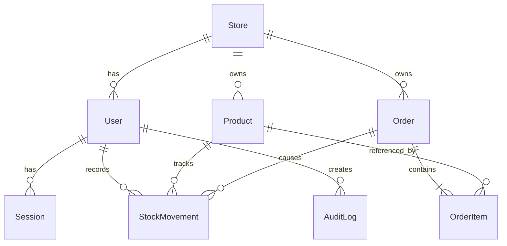

# Stokita

**Inventaris dan pesanan untuk banyak toko dengan data yang terpisah.** Stokita adalah proyek portofolio full stack untuk membantu tim di satu toko mencatat stok, memproses pesanan, dan membaca kondisi operasional dari data yang sama.

[Coba aplikasi](https://stokita-two.vercel.app) · [Lihat kode](https://github.com/ainsalimah/Stokita)

## Arti multi-toko di Stokita

Setiap toko memiliki produk, pesanan, stok, laporan, dan pengguna sendiri. Satu akun hanya terhubung ke satu toko. Contohnya, jika Ain mempunyai Toko A, Toko B, dan Toko C, Ain perlu akun owner terpisah di tiap toko dan masuk ke akun yang sesuai untuk mengelolanya. Versi ini belum menyediakan satu akun untuk berpindah toko atau melihat laporan gabungan ketiganya.

## Masalah

Ketika produk, stok, dan pesanan dicatat di tempat yang berbeda, tim perlu mencocokkan data secara manual. Stok yang terlihat tersedia belum tentu sesuai dengan pesanan yang sudah dikonfirmasi. Pemilik toko juga sulit melihat barang yang menipis dan pekerjaan yang masih menunggu.

## Solusi yang dibangun

Stokita menghubungkan katalog produk, catatan pergerakan stok, pesanan, dan laporan dalam satu aplikasi. Setiap tindakan memperbarui data toko yang sama, sehingga tim dapat mengikuti perubahan stok dari alasan pencatatan sampai pesanan yang menyebabkannya.

- **Inventaris yang dapat ditelusuri.** Catat stok masuk atau koreksi dengan alasan. Riwayat menyimpan jumlah perubahan, saldo sesudahnya, dan pengguna yang melakukan tindakan.
- **Pesanan dengan aturan stok.** Pesanan dimulai sebagai draft. Saat dikonfirmasi, sistem memeriksa ketersediaan dan mengurangi stok dalam satu transaksi. Pembatalan pesanan yang belum selesai mengembalikan stok.
- **Ruang kerja sesuai peran.** Pemilik melihat kinerja dan tim, manajer melihat prioritas stok dan pesanan, sedangkan staf melihat antrean pekerjaan toko.
- **Laporan siap dibagikan.** Ringkasan operasional tersedia di aplikasi dan daftar pesanan dapat diunduh sebagai file Excel berformat.
- **Data antartoko terpisah.** API menentukan toko dari sesi pengguna, bukan dari ID toko yang dikirim browser. Pengguna satu toko tidak dapat membaca data toko lain.

## Coba demo

Buka **[stokita-two.vercel.app](https://stokita-two.vercel.app)** lalu pilih **Pemilik**, **Manajer**, atau **Staf**. Tidak perlu email atau kata sandi. Setiap klik membuat toko demo pribadi dengan produk, stok, dan pesanan contoh. Data antarpengunjung terpisah dan tersedia selama 24 jam. Klik **Keluar** untuk mencoba peran lain.

| Peran | Yang paling terlihat di dashboard | Tindakan utama |
| --- | --- | --- |
| Pemilik | Kinerja toko, stok menipis, pengguna aktif, aktivitas terbaru | Buka laporan dan kelola pengguna |
| Manajer | Produk stok menipis, pesanan draft dan terkonfirmasi | Kelola produk, stok, dan pesanan |
| Staf | Antrean pesanan dan produk stok menipis | Buat pesanan dan catat stok |

**Alur singkat untuk mencoba:** pilih Staf, buka **Pergerakan stok**, catat stok masuk, lalu buat pesanan draft. Konfirmasi pesanan untuk melihat stok berkurang dan riwayat bertambah. Buka **Laporan** untuk melihat hasilnya. Untuk melihat pengelolaan pengguna, keluar lalu pilih Pemilik.

## Cara kerja

1. Pengguna masuk dan menerima sesi melalui cookie `HttpOnly`. API membaca peran dan toko dari sesi tersebut.
2. Produk memiliki SKU unik dalam satu toko. Pencatatan stok masuk atau koreksi selalu menyimpan alasan dan saldo terbaru.
3. Pesanan draft menyimpan item serta harga saat pesanan dibuat. Perubahan harga produk sesudahnya tidak mengubah pesanan lama.
4. Konfirmasi pesanan memeriksa stok setiap item lalu memperbarui pesanan, stok, pergerakan stok, dan audit log dalam transaksi database. Jika satu item tidak cukup, seluruh konfirmasi gagal tanpa perubahan sebagian.
5. Permintaan konfirmasi yang diulang tidak mengurangi stok dua kali. Pesanan terkonfirmasi dapat diselesaikan atau dibatalkan. Pembatalan mengembalikan stok satu kali.
6. Dashboard dan laporan membaca data toko sesuai sesi. Setiap peran mendapat fokus informasi yang berbeda.

## Keputusan teknis

| Area | Implementasi |
| --- | --- |
| Antarmuka | React, TypeScript, Tailwind CSS, dan Vite |
| API | Node.js, Express, TypeScript, REST API, dan validasi Zod |
| Data | PostgreSQL di Neon, Prisma, dan migrasi database |
| Akses | Sesi dalam cookie `HttpOnly`, pembatasan peran, dan filter toko di API |
| Konsistensi stok | Transaksi dengan isolasi `Serializable`, pemeriksaan stok saat memperbarui produk, dan transisi status pesanan |
| Deployment | Frontend dan API pada satu domain Vercel |

## Pengujian

- `npm test` memeriksa aturan status pesanan dan isi file laporan Excel.
- `npm run test:demo:integration` memeriksa masuk demo sebagai tiga peran, data awal, pemisahan toko, dan batas akses.
- `npm run test:integration` memeriksa alur penting pada database pengembangan, termasuk akses lintas toko, dua konfirmasi yang bersaing untuk stok terakhir, serta konfirmasi dan pembatalan yang diulang.
- `npm run typecheck` dan `npm run build` memeriksa tipe TypeScript dan hasil build aplikasi.

## Jalankan lokal

1. Siapkan Node.js 22+ dan PostgreSQL. Buat database `stokita`.
2. Salin `.env.example` ke `.env`, lalu ubah `DATABASE_URL` dan `DIRECT_URL`. Untuk PostgreSQL lokal, kedua URL boleh sama.
3. Jalankan `npm install` dan `npm run db:deploy`. Data contoh dibuat otomatis saat tombol demo diklik.
4. Jalankan `npm run dev`. Buka `http://localhost:3001`. Perubahan kode memerlukan restart. Untuk mode hot reload pada lingkungan yang mendukungnya, gunakan `npm run dev:watch` dan buka `http://localhost:5173`.

Untuk memeriksa proyek: `npm run typecheck`, `npm test`, dan `npm run build`.

Untuk menguji demo sekali klik pada database pengembangan, jalankan server dan `npm run test:demo:integration`. Pengujian ini membuat tiga ruang demo sementara. Alamat server bawaan adalah `http://localhost:3001`.

Seed akun tetap tersedia untuk pengembangan atau pengujian login biasa. Jika diperlukan, set `SEED_DEMO_PASSWORD` di `.env`, jalankan `npm run db:seed`, lalu gunakan nilai yang sama untuk `TEST_DEMO_PASSWORD` saat menjalankan `npm run test:integration`. Gunakan database khusus pengembangan karena pengujian membuat data baru.

## Aturan bisnis dan batasan

- `OWNER` mengelola pengguna dan produk. `MANAGER` mengelola produk. `STAFF` dapat mencatat stok dan pesanan. Semua peran dapat melihat laporan toko sendiri.
- Dashboard menyesuaikan peran: owner melihat kinerja dan tim, manager melihat prioritas stok serta pesanan, dan staff melihat antrean pesanan serta tindakan operasional. Antrean adalah pesanan toko, bukan tugas pribadi.
- Setiap permintaan membaca identitas toko dari sesi pada cookie `HttpOnly`. ID toko dari browser tidak dipercaya.
- SKU unik dalam satu toko. Stok bertambah melalui `IN` atau koreksi positif, dan dapat berkurang melalui koreksi negatif selama saldo tetap tidak negatif.
- Pesanan dibuat sebagai `DRAFT`. Konfirmasi mengurangi stok dan membuat catatan pergerakan. Konfirmasi berulang mengembalikan status yang sama tanpa mengurangi stok lagi.
- Pesanan `CONFIRMED` dapat diselesaikan atau dibatalkan. Pembatalan mengembalikan stok sekali. Pesanan `FULFILLED` tidak dapat dibatalkan.
- Semua harga berupa bilangan bulat rupiah. Harga pada item pesanan disalin saat draft dibuat agar perubahan harga katalog tidak mengubah pesanan lama.
- Versi ini memakai satu lokasi stok per toko. Pembayaran, kurir, dan banyak gudang berada di luar cakupan proyek.

## Struktur data

## REST API

Semua endpoint di bawah memakai prefix `/api`. Selain login dan health, semuanya memerlukan sesi.

| Metode | Endpoint | Keterangan |
| --- | --- | --- |
| POST | `/auth/login` | Login dengan email dan password |
| POST | `/auth/demo` | Buat ruang demo pribadi dan langsung masuk sebagai `OWNER`, `MANAGER`, atau `STAFF` |
| GET / POST | `/auth/me`, `/auth/logout` | Sesi saat ini dan logout |
| GET / POST / PATCH | `/users`, `/users/:id` | Daftar, tambah, dan aktifkan atau nonaktifkan pengguna. Khusus owner |
| GET / POST / PATCH | `/products`, `/products/:id` | Daftar dan kelola produk |
| GET / POST | `/stock-movements` | Riwayat dan perubahan stok |
| GET / POST | `/orders` | Daftar dan buat draft pesanan |
| POST | `/orders/:id/confirm` | Konfirmasi dan kurangi stok |
| POST | `/orders/:id/cancel` | Batalkan dan kembalikan stok |
| POST | `/orders/:id/fulfill` | Tandai selesai |
| GET | `/dashboard` | Ringkasan sesuai peran dengan data yang dibatasi ke toko pengguna |
| GET | `/reports/summary`, `/reports/orders.xlsx` | Ringkasan dan Excel berformat |

Endpoint daftar produk dan pesanan menerima `page`, `limit`, dan `search`. Daftar pesanan juga menerima `status`. Kesalahan dikembalikan sebagai `{ "error": "..." }`, dan validasi dapat memuat `details` per field.

`POST /auth/demo` menerima `{ "role": "STAFF" }` (atau `OWNER`/`MANAGER`). Endpoint ini membatasi jumlah ruang demo aktif dan pembuatan baru per menit. Tiap ruang demo juga membatasi jumlah pengguna, produk, pesanan, dan catatan stok. Jalankan migrasi database terbaru sebelum menerbitkan versi aplikasi yang berisi tombol demo.

## Deployment gratis: Vercel + Neon

Frontend Vite dan API Express berada dalam satu project Vercel dan satu domain. Vercel menyajikan hasil build React. Semua `/api/*` dijalankan oleh satu Function, sedangkan Neon menyimpan PostgreSQL.

1. Buat project PostgreSQL di Neon. Dari panel **Connect**, salin URL **pooled** untuk `DATABASE_URL` dan URL **direct** untuk `DIRECT_URL`. Kedua URL harus menunjuk ke database yang sama. Simpan sebagai variabel lingkungan lokal di `.env` dan jangan commit URL atau password.
2. Jalankan `npm install` dan `npm run db:deploy` dari komputer lokal. Perintah migrasi menggunakan `DIRECT_URL`, sedangkan aplikasi menggunakan `DATABASE_URL`. Tombol demo membuat data contoh sendiri, jadi seed tidak diperlukan untuk demo publik.
3. Push repositori ke GitHub, lalu import ke Vercel sebagai satu project. Set **Framework Preset: Vite** dan **Root Directory: repository root**. `vercel.json` sudah mengatur build, output, Function API, dan rute SPA.
4. Tambahkan variabel `DATABASE_URL` (pooled) dan `DIRECT_URL` (direct) pada environment Vercel Production. Deploy setelah migrasi berhasil. Untuk Preview, gunakan database Neon terpisah atau lindungi deployment agar data demo Production tidak tercampur.
5. Cek `https://domain-vercel/api/health`, lalu uji tombol demo, stok, pesanan, dashboard, dan unduhan Excel. Jika tombol demo gagal setelah deployment, periksa kedua URL Neon dan status migrasi. Gunakan region Vercel yang dekat dengan region Neon untuk mengurangi jeda.

Pada paket gratis, kapasitas dan batas penggunaan mengikuti kebijakan masing-masing penyedia. Demo ini ditujukan untuk portofolio pribadi. Awasi kuota Vercel dan Neon jika mulai ramai.
