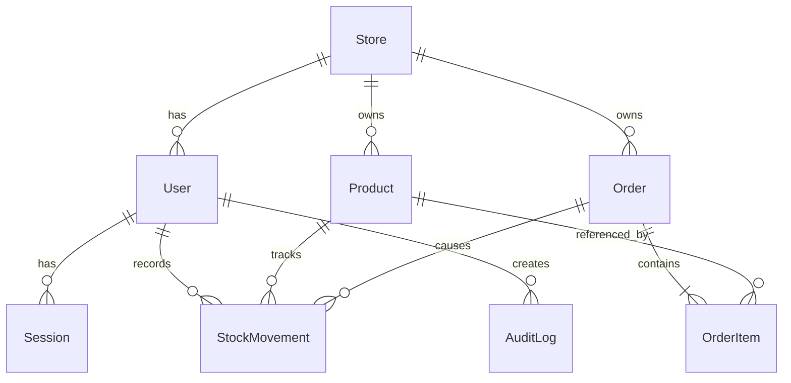

# Stokita

Portofolio full stack untuk inventaris dan pesanan multi-toko. Dibuat dengan React, TypeScript, Tailwind CSS, Express, Prisma, dan PostgreSQL.

## Coba demo

Buka **[Stokita](https://stokita-two.vercel.app)**, lalu pilih **Pemilik**, **Manajer**, atau **Staf** di halaman awal. Demo langsung terbuka tanpa email atau kata sandi. Setiap pilihan membuat toko pribadi berisi produk, stok, dan pesanan contoh. Data antar pengunjung terpisah dan tersedia selama 24 jam. Untuk mencoba peran lain, klik **Keluar** lalu pilih tombol peran yang berbeda.

## Jalankan lokal

1. Siapkan Node.js 22+ dan PostgreSQL. Buat database `stokita`.
2. Salin `.env.example` ke `.env`, lalu ubah `DATABASE_URL` dan `DIRECT_URL`. Untuk PostgreSQL lokal, kedua URL boleh sama.
3. Jalankan `npm install` dan `npm run db:deploy`. Data contoh dibuat otomatis saat tombol demo diklik.
4. Jalankan `npm run dev`. Buka `http://localhost:3001`. Perubahan kode memerlukan restart. Untuk mode hot reload pada lingkungan yang mendukungnya, gunakan `npm run dev:watch` dan buka `http://localhost:5173`.

Untuk memeriksa proyek: `npm run typecheck`, `npm test`, dan `npm run build`.

Untuk menguji demo sekali klik pada database pengembangan, jalankan server dan `npm run test:demo:integration`. Pengujian ini membuat tiga ruang demo sementara; alamat server bawaan adalah `http://localhost:3001`.

Seed akun tetap tersedia untuk pengembangan atau pengujian login biasa. Jika diperlukan, set `SEED_DEMO_PASSWORD` di `.env`, jalankan `npm run db:seed`, lalu gunakan nilai yang sama untuk `TEST_DEMO_PASSWORD` saat menjalankan `npm run test:integration`. Gunakan database khusus pengembangan karena pengujian membuat data baru.

## Alur dan aturan bisnis

- `OWNER` mengelola pengguna dan produk. `MANAGER` mengelola produk. `STAFF` dapat mencatat stok dan pesanan. Semua peran dapat melihat laporan toko sendiri.
- Dashboard menyesuaikan peran: owner melihat kinerja dan tim, manager melihat prioritas stok serta pesanan, dan staff melihat antrean pesanan serta tindakan operasional. Antrean adalah pesanan toko, bukan tugas pribadi.
- Setiap permintaan membaca identitas toko dari sesi pada cookie `HttpOnly`; ID toko dari browser tidak dipercaya.
- SKU unik dalam satu toko. Stok bertambah melalui `IN` atau koreksi positif, dan dapat berkurang melalui koreksi negatif selama saldo tetap tidak negatif.
- Pesanan dibuat sebagai `DRAFT`. Konfirmasi mengurangi stok dan membuat catatan pergerakan. Konfirmasi berulang mengembalikan status yang sama tanpa mengurangi stok lagi.
- Pesanan `CONFIRMED` dapat diselesaikan atau dibatalkan. Pembatalan mengembalikan stok sekali. Pesanan `FULFILLED` tidak dapat dibatalkan.
- Semua harga berupa bilangan bulat rupiah. Harga pada item pesanan disalin saat draft dibuat agar perubahan harga katalog tidak mengubah pesanan lama.

## Struktur data

## REST API

Semua endpoint di bawah memakai prefix `/api`. Selain login dan health, semuanya memerlukan sesi.

| Metode | Endpoint | Keterangan |
| --- | --- | --- |
| POST | `/auth/login` | Login dengan email dan password |
| POST | `/auth/demo` | Buat ruang demo pribadi dan langsung masuk sebagai `OWNER`, `MANAGER`, atau `STAFF` |
| GET / POST | `/auth/me`, `/auth/logout` | Sesi saat ini dan logout |
| GET / POST / PATCH | `/users`, `/users/:id` | Daftar, tambah, aktif/nonaktif pengguna; hanya owner |
| GET / POST / PATCH | `/products`, `/products/:id` | Daftar dan kelola produk |
| GET / POST | `/stock-movements` | Riwayat dan perubahan stok |
| GET / POST | `/orders` | Daftar dan buat draft pesanan |
| POST | `/orders/:id/confirm` | Konfirmasi dan kurangi stok |
| POST | `/orders/:id/cancel` | Batalkan dan kembalikan stok |
| POST | `/orders/:id/fulfill` | Tandai selesai |
| GET | `/dashboard` | Ringkasan sesuai peran pengguna dari sesi; data selalu dibatasi ke toko pengguna |
| GET | `/reports/summary`, `/reports/orders.xlsx` | Ringkasan dan Excel berformat |

Endpoint daftar produk dan pesanan menerima `page`, `limit`, `search`; pesanan juga menerima `status`. Kesalahan dikembalikan sebagai `{ "error": "..." }`, dan validasi dapat memuat `details` per field.

`POST /auth/demo` menerima `{ "role": "STAFF" }` (atau `OWNER`/`MANAGER`). Endpoint ini membatasi jumlah ruang demo aktif dan pembuatan baru per menit. Tiap ruang demo juga membatasi jumlah pengguna, produk, pesanan, dan catatan stok. Jalankan migrasi database terbaru sebelum menerbitkan versi aplikasi yang berisi tombol demo.

## Deployment gratis: Vercel + Neon

Frontend Vite dan API Express berada dalam satu project Vercel dan satu domain. Vercel menyajikan hasil build React; semua `/api/*` dijalankan oleh satu Function. Neon menyimpan PostgreSQL. Tidak diperlukan server Express yang selalu hidup.

1. Buat project PostgreSQL di Neon. Dari panel **Connect**, salin URL **pooled** untuk `DATABASE_URL` dan URL **direct** untuk `DIRECT_URL`. Kedua URL harus menunjuk ke database yang sama. Simpan sebagai variabel lingkungan lokal di `.env`; jangan commit URL atau password.
2. Jalankan `npm install` dan `npm run db:deploy` dari komputer lokal. Perintah migrasi menggunakan `DIRECT_URL`; aplikasi menggunakan `DATABASE_URL`. Tombol demo membuat data contoh sendiri, jadi seed tidak diperlukan untuk demo publik.
3. Push repositori ke GitHub, lalu import ke Vercel sebagai satu project. Set **Framework Preset: Vite** dan **Root Directory: repository root**. `vercel.json` sudah mengatur build, output, Function API, dan rute SPA.
4. Tambahkan variabel `DATABASE_URL` (pooled) dan `DIRECT_URL` (direct) pada environment Vercel Production. Deploy setelah migrasi berhasil. Untuk Preview, gunakan database Neon terpisah atau lindungi deployment agar data demo Production tidak tercampur.
5. Cek `https://domain-vercel/api/health`, lalu uji tombol demo, stok, pesanan, dashboard, dan unduhan Excel. Jika tombol demo gagal setelah deployment, periksa kedua URL Neon dan status migrasi. Gunakan region Vercel yang dekat dengan region Neon untuk mengurangi jeda.

Pada paket gratis, kapasitas dan batas penggunaan mengikuti kebijakan masing-masing penyedia. Demo ini ditujukan untuk portofolio pribadi; awasi kuota Vercel dan Neon jika mulai ramai.

Tautan aplikasi: **[stokita-two.vercel.app](https://stokita-two.vercel.app)**.
